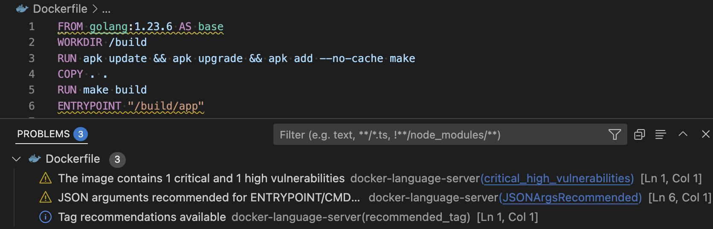
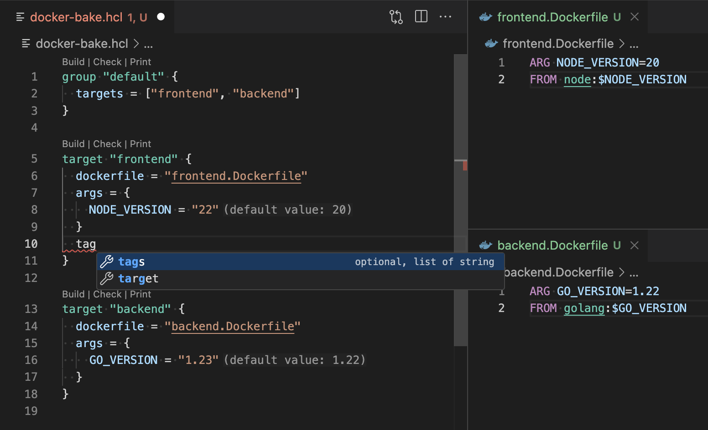
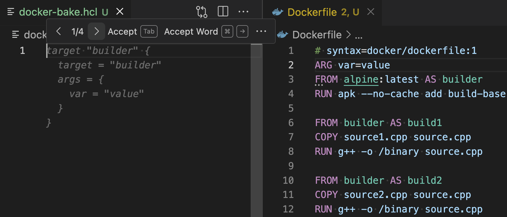
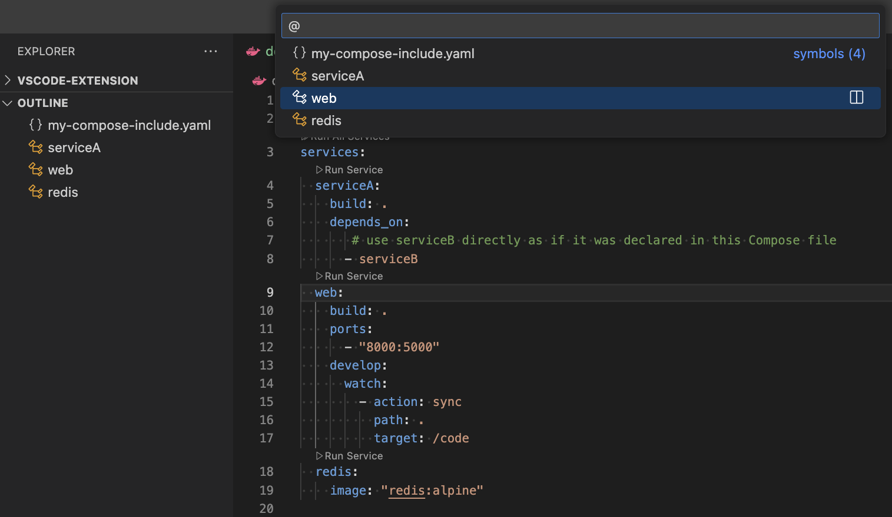

# Docker VS Code Extension (experimental)

The **Docker VS Code Extension (experimental)** extension adds the following features to Visual Studio Code:

- [Dockerfile linting](https://docs.docker.com/reference/build-checks/)
- support for [Bake](https://docs.docker.com/build/bake/) files
- code outline overview for Compose files
- scan Dockerfiles for references to images with vulnerabilities (experimental)

## Requirements

The extension requires a Docker Engine to be running. [Install Docker Desktop](https://www.docker.com/get-started/) on your machine and make sure `docker` is on your system path.

We only support the following operating systems and architectures at the moment. If you are on an unsupported system, please let us know of your interest in this extension so we can prioritize the work accordingly.

| Operating System | Architecture |
| ---------------- | ------------ |
| Windows          | amd64        |
| Windows          | arm64        |
| macOS            | amd64        |
| macOS            | arm64        |
| Linux            | amd64        |
| Linux            | arm64        |

## Features Overview

### Editing Dockerfiles

You can get linting checks from [BuildKit](https://github.com/moby/buildkit) and [BuildX](https://github.com/docker/buildx) when editing your Dockerfiles. Any references to images with with vulnerabilities will also be flagged (note that this is an experimental feature). The errors will be visible directly in your editor or you can look at them by opening up the Problems panel (<kbd>Ctrl+Shift+M</kbd> on Windows/Linux, <kbd>Shift+Command+M</kbd> on Mac).

### Editing Bake Files

You can get code completion when editing your `docker-bake.hcl` Bake file. You will also be able to hover over variables and navigate around the file by jumping to a variable's definition or jumping to the build stage within a Dockerfile

The extension will provide inline suggestions to generate a Bake target to correspond to each build stage in your Dockerfile.

### Editing Compose Files

You can view an outline of your Compose file which will make it easier to navigate around the file.

## Builds

Our [GitHub Actions](https://github.com/docker/docker-vscode-extension/actions) build six VSIX files for the `amd64` and `arm64` platforms for the three major operating systems (Windows, macOS, Linux). The language server binary from these builds are not signed and/or notarized so you may encounter issues when using VSIX files from this repository as your operating system may refuse to open an unsigned binary.

## Development

To debug the VS Code extension, you will need to:

1. Clone this repository.
2. Open VS Code on the cloned folder.
3. Create a `bin` folder in the root.
4. Download a Docker Language Server [binary](https://github.com/docker/docker-language-server) and place it in the `bin` folder you created. You can alternatively follow the instructions in that repository and build a binary yourself to place in the `bin` folder.

If you would like to debug both the VS Code extension _and_ the language server, then you will need to clone the [docker/docker-language-server repository](https://github.com/docker/docker-language-server) and then start the language server in debug mode with the `--address :49201` argument. After the server has started in debug mode, you can set the port number (`49201` is the default port that is used for any launch configurations saved in Git) as a value for the `docker.lsp.debugServerPort` VS Code setting. Now you can launch the extension in debug mode and it should connect to the language server you started in debug mode instead of trying to execute a binary in the `bin` folder.

## Telemetry

This extension collects telemetry. You can configue the telemetry you would like to send by changing the `docker.lsp.telemetry` setting. Note that if `vscode.env.isTelemetryEnabled` returns `false` then telemetry will not be sent regardless of the value of the `docker.lsp.telemetry` setting.

Please read our [privacy policy](https://www.docker.com/legal/docker-privacy-policy/) to learn more about how the information will be collected and used.
